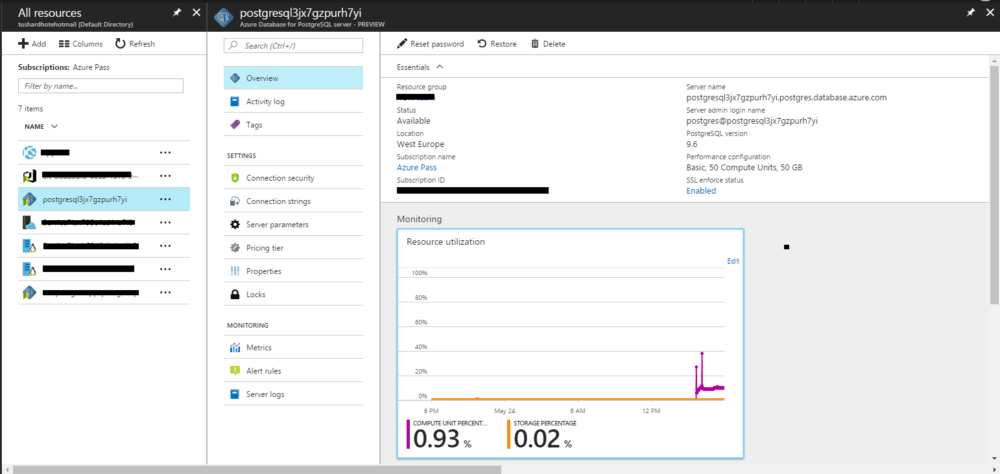
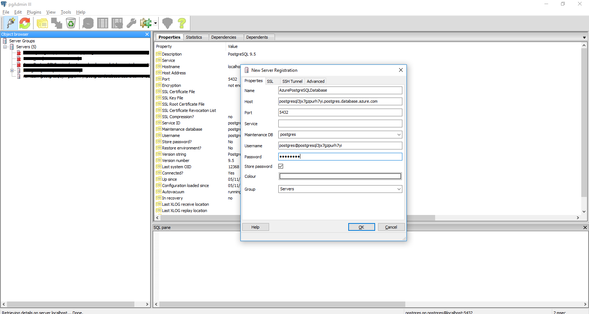
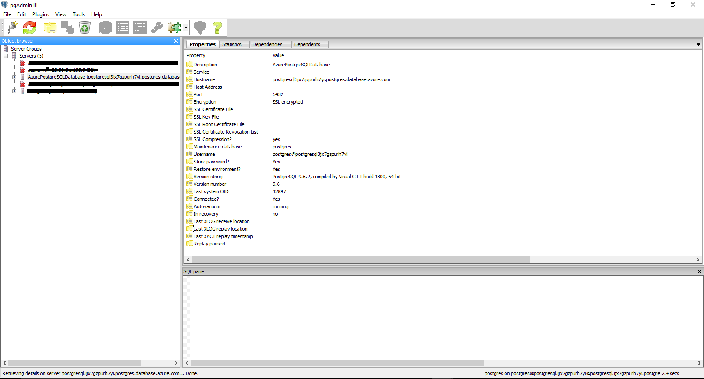
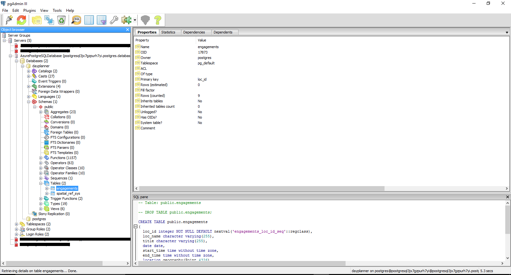

# Test PostgreSQL Connection

1.	Click on the PostgreSQL managed database service. 

    

1. Download <a href="https://www.pgadmin.org/download/">pgAdmin-3</a> for connecting the Server database.

1. Open the pgAdmin-3 to connect ServerDatabase on local environment. 

    - Name:- AzurePostgreSQLDatabase 
    - HostName:- postgresql3jx7gzpurh7yi.postgres.database.azure.com 
    - Username:- postgres@postgresql3jx7gzpurh7yi 
    - Password:- pg@12345  

    

1. After successful connection the `AzurePostgreSQLDatabase` server is visible on pgAdmin-3.

    

1.	The first time the Server will contain `dayplanner` database. The first time that you run the web app in environment then `engagement` table with sample data with current date will be created. 

    

1.	The schema of `engagement` table are as follows.
    
    Column Name | Data Type | Description
    ------------ | -------------
    loc_id | serial | Unique id of engagement with auto-increament feature
    loc_name | character varying(255) | Location address of engagement where it is schedule
    title | character varying(255) | Subject of engagement
    date | date | Date of engagement
    start_time | time without time zone | Start time of engagement
    end_time | time without time zone | End time of engagement
    location | geography(Point) | latitude and longitude of engagement with PostGIS features

<a href="#">Next</a> 
 
