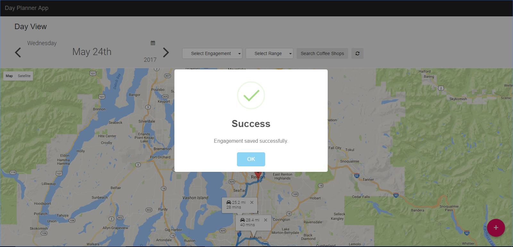

# Test the Web Apps 

The application is based on managing the Day-To-Day Engagements. User can add their engagements randomly with following parameters,

Parameter | Description
------------ | -------------
ame | Title of engagement
Location | Location of the Engagement
Meeting Date | Date of engagement 
Start Time | Start time of engagement
End Time | End time of engagement

All the Engagement are stored in __AzureDB for PostgreSQL__. It is a powerful, open source object-relational database system which has `GeoSpatial` capabilities `PostGIS` functionality 
and it is managed service by Azure by the `Azure Database for PostgreSQL Service` name. The data are plotted on the map according to Engagement Date and Ascending order of the Start Time. 

__Azure Search Service__ is a component and one of the best service of the Microsoft Azure Cloud Platform providing indexing and querying capabilities for data uploaded to Microsoft servers. 
The Search as a service framework is intended to provide developers with complex search capabilities for mobile and web development while hiding infrastructure requirements and search algorithm complexities. 
Azure Search is a recent addition to Microsoft's Infrastructure as a Service (IaaS) approach.

__Azure App Service__ is integrate App Service into your existing frameworks, languages and tooling to accelerate your development. It is rapidly build, deploy and manage powerful web, mobile and API apps for employees or customers using a single back-end. 
Build standards-based web apps and APIs using .NET, Java, Node.js, PHP and Python.

Following are the steps to visite the hosted website with all this features:-

1.	Go to your Microsoft Azure subscription. 

1.	Click on `Resource groups`.

1.	Search for the resource group that you created using ARM Template.

    

1.	Click on the resource group to view all of the existing resources.
    - Azure App Service.
    - Azure Database for PostgreSQL Service
    - Azure Search Service
    - Azure App Service plan
    - ….

    

1.	Click on the second website, the one that has the `App Service` key in the its __Type__.

    

1.	The overview of the `App Service` will open up, it contains the `URL` where our application is hosted.

    

1.	Once you click on the `URL`, the application gets launched first time it will take some time to launch the application. The reason behind this is, it will create the table schema with sample data inserted automatically according to current date, locations are plotted on the map according to start time of the Engagement. The route and distance between two Engagements are displayed on the map. 

    

1.	As you click on the any marker it will display the details of that location which includes `Engagement Title`, `Start Time` of Engagement, `End Time` of Engagement and the `Location` of the Engagement.

    

1.	Click on the `Add` button ,we can add the new engagement from the website.

    

1.	The model is pop-up on the screen, contain the details of the engagement which we want to schedule.

    

1.	After the adding the engagement successfully it is stored in __PostgreSQL__ database and it will show a success message on the screen.

    

1.	The engagement which we added last time is automatically reflected on the map.

    

1.	Now, the web application provides the functionality of __Azure Search__, for that we have the controls on the Web Site.

    

1.	First, select the `Engagement` to which we are applying the __Azure Search__.

    

1.	After that select the number of `miles` to which we are applying the __Azure Search__.

    

1.	Finally, click on the `Search Coffee Shops` button for applying __Azure Search__.

    

1.	Depending on the selection i.e. selected `Engagement`, selected `Miles` the Azure Search will apply and it will display the number of Coffee Shops are available in particular miles, all this functionality happed on the website with the help of __Azure Search Service__.

    

1.	Click on the `Reset` button for re-initializing the `Azure Search Controls` on the website.

    

1.	For toggle between the date the `left arrow` and `right arrow` will help us.

    

<a href="TestPostgreSQLConnection.md">Next</a>